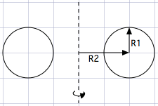
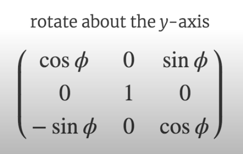
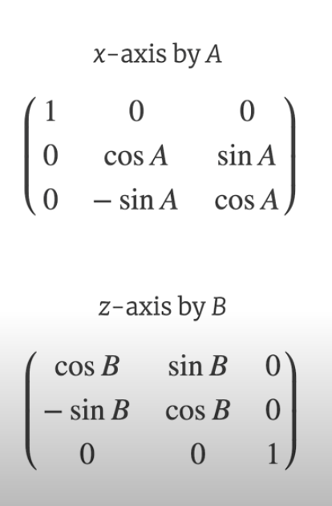
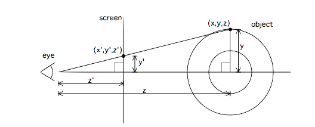
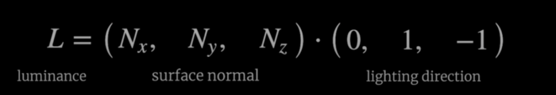
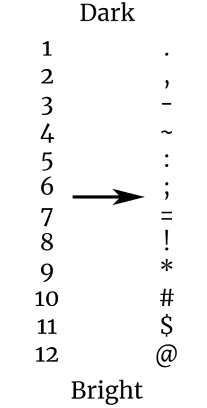
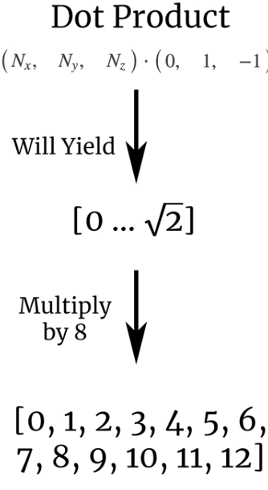
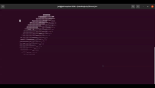

## JDonut
a Terminal application made in java base on the C code developed by **Andy Sloane** you can find
the full maths behind it [here](https://www.a1k0n.net/2011/07/20/donut-math.html)

## Explanation (Not Mine)
  The “pixels” are ASCII characters .,-~:;=!*#$@ that accounts for the illumination 
  value of the surface, but I'll explain step by step below along with the math.
  
## Steps

1. Create a cirlce of radius R2 centered at R2

2. Create a torus('donut') which rotates on the Y axis

3. Now, we need to rotate about the X and Z axis so it looks like it's floating
and spinning on the screen. Basically, a flying donut. Why not?

4. Well, how to map this 3D object into 2D ie terminal screen?

Each character in the code corresponds to a pixel on our terminal. However, how to 
shade it? For this, we calculate the dot product of the surface normal and the direction 
of the light. This will say how light and how dark will look on the screen.

The output of the dot product will be:

5. Finally you map the result of the dot product (step 4) to these characters to 
tweak the lighting. That's it!

## Here is the code in action

